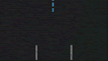
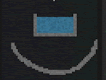
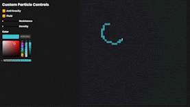
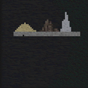
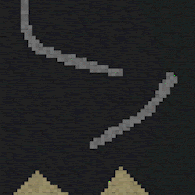
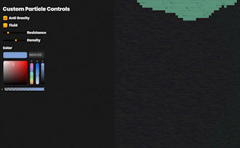

# Sandfall
## A Cellular Automata

Recently, my friend introduced me to a game called Noita. It's a take on the classic falling sand genre of video games but combines the physics of falling sand with action rogue-like gameplay. So, when thinking about what to make for my game, I chose to create a basic implementation of Noita's physics engine.

At its core, the physics engine I created is a type of complex cellular automaton called a falling sand simulator. You can think of a cellular automaton as a turn-based game where the world is composed of a grid of individual cells. During each turn, every cell in the world is modified based on the types of cells surrounding it and a particular ruleset. To create the falling sand simulation, we change the ruleset to simulate real-world physics.

## Falling Sand

To begin creating the falling sand simulation, I made a large grid where every cell contained in the grid is of the type empty. I then moved on to creating my first interactive cell, sand. To do this, I made a new cell with the type of "sand" and gave it the following rules.

**Sand Rules:**

- If the cell below it is empty, move down
- Else if the cell below it to the left is empty, move down and to the left
- Else if the cell below it to the right is empty, move down and to the right
- And If no cells are available, remain in the same place

This led to small triangular stacks forming. Now with this basic functionality creating new particles is intuitive. For example, a fluid acts the same way as a solid, like sand; however, it can also move horizontally. Giving us these new rules:

**Fluid Rules:**

- Normal Sand Rules
- Else if the cell to the immediate left is empty, move left
- Else if the cell to the immediate right is empty, move right
- And If no cells are available, remain in the same place

The beauty in cellular automatons is that you can create incredibly complex behaviour from an elementary set of rules. For example, the rulesets above lead to the following behaviour:

## Introducing Complexity

From here, we can create many different fluids and solids; however, they will all act the same. They will sit on each other, and solids will only form triangular piles. To address this in my simulation, I added inertial resistance and density. The basic idea is that each cell will check the density of its neighbours instead of if it's "empty." Now for solids, there will be a chance (based on the inertial resistance) that the cell won't move down to the left or right. We can then add higher resistance to different elements to create sand, dirt and stone, and all have them act slightly differently.

## Making It Fun

Now that I had a decently complex simulation with fluids and solids, where each cell acted on simulated density and inertia, I set out to give the player more freedom. Which turned into adding a simple GUI and allowing them to create their own cells by adjusting the variables. The GUI enabled the player to create a fluid, solid, inverse gravity, change the resistance, and the density of the cell, and finally, change the cell's colour. I also added an eraser so players could remove any mistakes. Which all led to absolute chaos, but it was fun chaos.

## Where To Go From Here

### Optimization

Optimization of this project was the most challenging task. Rendering over 3500 cells in every frame is difficult for most computers. The obvious fix would be to take advantage of multithreading and parallelize the computations. However, if I were to expand the game to something of the scale like Noita, parallelization would not be adequate as Unity's overhead would become the bottleneck. The logical choice would be redesigning the systems using a low-level language like Rust. Which would allow me to remove the overhead of Unity while having a much more open development environment. Furthermore, multithreading in a low-level language like Rust is much more accessible.

### Adding a Player

Adding a player would make the game much more fun as you could see how the environment you created affects the player's character. For example, there could be elements like a poison that corrodes or lava that burns. The possibilities are endless. The only reason I have yet to implement this is I am having a hard time figuring out how to render the player and have him interact with the environment since it is still a cellular automaton.

## Refactor To Use Generics

Lastly, a refactor of the code is in order. The code became reminiscent of spaghetti as the project continued, especially when I added the custom cell.  One of the better solutions I plan on implementing in my redesign is a better abstraction of the code, allowing me to use generics, which would help make the code much more readable.

## Conclusion

With that said, I hope you enjoyed my little paper/devlog on how I built this game/simulation and how I plan to expand upon it in the future. Overall the project was a great time, and I look forward to expanding upon it.

## Screenshots and GIFS

